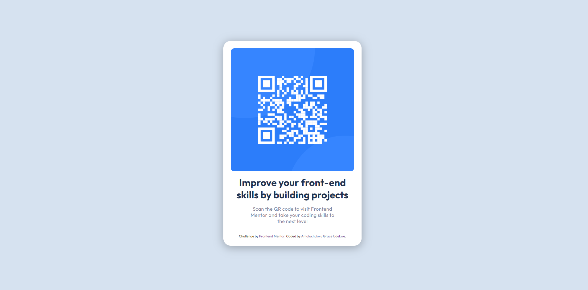

# Frontend Mentor - QR code component solution

This is a solution to the [QR code component challenge on Frontend Mentor](https://www.frontendmentor.io/challenges/qr-code-component-iux_sIO_H). Frontend Mentor challenges help you improve your coding skills by building realistic projects. 

## Table of contents

- [Overview](#overview)
  - [Screenshot](#screenshot)
  - [Links](#links)
- [My process](#my-process)
  - [Built with](#built-with)
  - [What I learned](#what-i-learned)
  - [Continued development](#continued-development)
- [Author](#author)
- [Acknowledgments](#acknowledgments)


## Overview
This is my solution to the Frontend Mentor | QR code component.
I am open to any corrections or advice to how I approached the challenge.
(Also, I didn't understand what links I was supposed to put up in the Link section)

### Screenshot
    

<!-- ./images/qr-code Screenshot.png -->


### Links

- Solution URL: [https://github.com/Grace406/Gracie-s-Frontend-Mentor-QR-code-component.git]
- Live Site URL: [Add live site URL here](https://github.com/Grace406/Gracie-s-Frontend-Mentor-QR-code-component.git)

## My process
I started out doing the structure and then adding my styles... I got stuck trying to get to perfection, I procastinated a lot and then finally I styled the project and when t came to making it reponsive, i got stuck, I used YouTube videos and asked questions and I finally just made it responsive. 

It was a good learning process for me and I just think that when I'm doing my next challenge, I'll tackle it better and spend less time.

### Built with

- Semantic HTML5 markup
- CSS custom properties
- Flexbox
- CSS Grid


### What I learned


-I learnt how to use google and someother resources for my benefit.

-I learnt to always try and make my code concise

-I learnt that I shouldn't take the amount of time i did on a simple project, there was a lot of procastination on my end and It wasted a lot of my time.

```html
  <link rel="icon" type="image/png" sizes="32x32" href="./images/favicon-32x32.png">

```
```css
.container {
      box-shadow: 0 5px 30px hsla(0, 0%, 0%, 0.30) ;

}
```


### Continued development


-In future projects, I want to focus more on the responsiveness and flex-box.

-I'm not completely comfortable with the respnsiveness.

-A mistake I made was the fact that when I was building at first, I just built and put in anything, not thinking of whether I was doing the design for mobile or desktop etc. Then when it came to making the project responsive, I got confused and I would pick up my laptop and be stuck for hours trying to make it responsive. 


## Author

- Frontend Mentor - [@Grace406](https://www.frontendmentor.io/profile/Grace406)
- Twitter - [@_she_codes04](https://www.twitter.com/_she_codes04)


## Acknowledgments

I watched different youtube videos and then towards the end of my challenge completion, I saw a tip on what to do in someone's solution and i feel bad that i cant give him/her a shoutout... thannk you! Your solution aided me.

